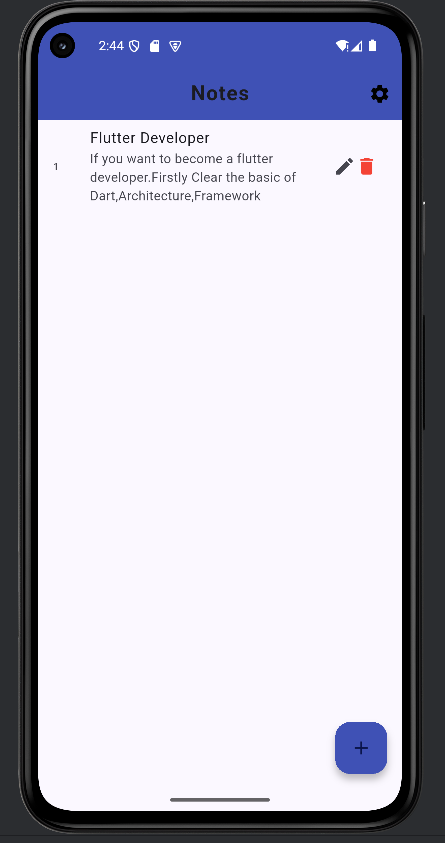
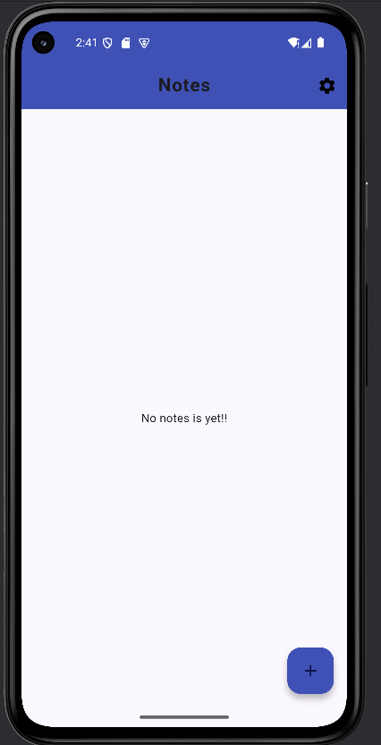
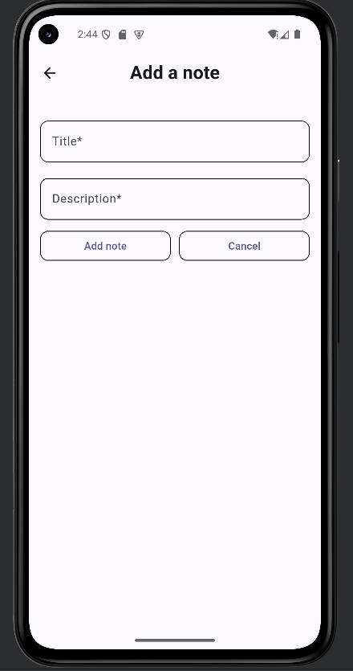
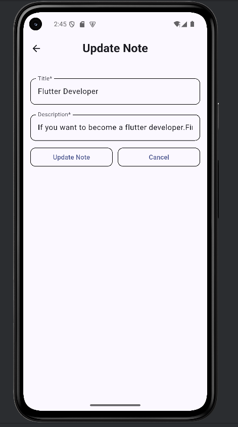
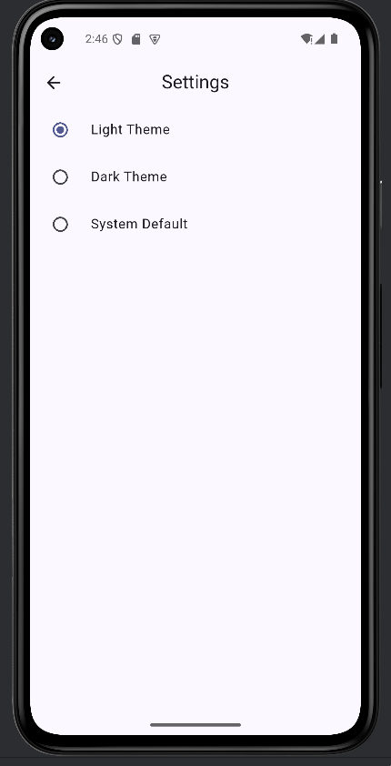
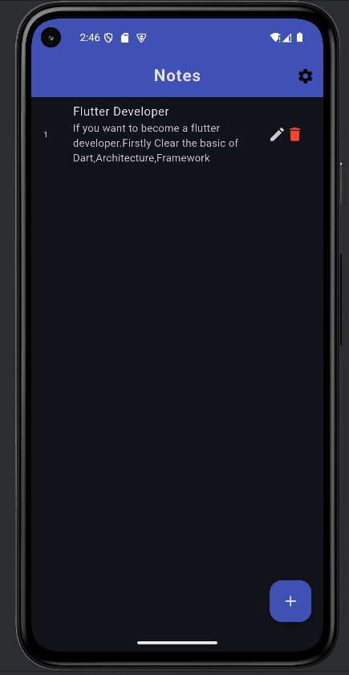

<h1 align="center">📝 Notes App</h1>

<p align="center">
<b>A modern offline-first Notes application built with Flutter.</b><br>
Designed with clean architecture principles, Provider state management, and SQLite to deliver a fast, elegant, and responsive note-taking experience.
</p>

<p align="center">


</p>

<p align="center">
⭐ Clean UI • ⚡ Fast Performance • 🌙 Dark Mode • 💾 Offline Storage • 📱 Material Design
</p>

---

# 📖 About the Project

Notes App is a modern cross-platform note-taking application developed with **Flutter**, designed to showcase real-world mobile application development practices. The application allows users to create, update, organize, and manage notes locally using **SQLite**, while **Provider** ensures efficient and scalable state management.

Built with an offline-first approach, the project focuses on clean architecture, reusable widgets, responsive UI, and maintainable code structure. It demonstrates practical Flutter development skills that are commonly used in production-grade mobile applications.

---

# ✨ Features

- 📝 Create, update, and delete notes
- 💾 Offline local storage using SQLite
- 🎨 Light & Dark Theme support
- ⚡ Fast and responsive user interface
- 📱 Clean Material Design UI
- 🏗️ Provider state management
- ♻️ Reusable widget architecture
- 📂 Organized project structure
- 🚀 Optimized Flutter performance

---

# 🛠 Tech Stack

| Technology | Purpose |
|------------|---------|
| Flutter | Cross-platform Mobile Development |
| Dart | Programming Language |
| SQLite (sqflite) | Local Database |
| Provider | State Management |
| Android Studio | Development Environment |
| Git & GitHub | Version Control |

---

# 📱 Screenshots

## 🏠 Home Screen

| Empty State | Notes Added |
|:-----------:|:-----------:|
|  |  |

---

## 📝 Note Management

| Add Note | Update Note |
|:---------:|:-----------:|
|  |  |

---

## 🎨 Theme Support

| Light Theme | Dark Theme |
|:-----------:|:----------:|
|  |  |

---

# 🚀 Getting Started

### Clone the repository

```bash
git clone https://github.com/Umairawan670/Notes-App.git
```

### Navigate to the project

```bash
cd Notes-App
```

### Install dependencies

```bash
flutter pub get
```

### Run the application

```bash
flutter run
```

---

# 📂 Project Structure

```
lib/
├── db/
├── models/
├── providers/
├── screens/
├── themes/
├── widgets/
└── main.dart
```

---

# 🎯 Future Improvements

- 🔍 Search Notes
- ⭐ Favorite Notes
- ☁️ Firebase Cloud Sync
- 📌 Categories & Tags
- 🔔 Reminder Notifications
- 🔐 App Lock (PIN / Biometrics)
- 📤 Export & Import Notes
- 🤖 AI-powered Note Summaries

---

# 👨‍💻 Developer

**Umair Awan**

**Junior Flutter Developer | Cross-Platform Mobile App Developer**

📧 **Email:** umairawan0691@gmail.com

💼 **LinkedIn:** https://www.linkedin.com/in/umair-awan-812537300/

💻 **GitHub:** https://github.com/Umairawan670

---

<p align="center">

### ⭐ If you found this project useful, consider giving it a Star!

Made with ❤️ using **Flutter** & **Dart**

</p>
